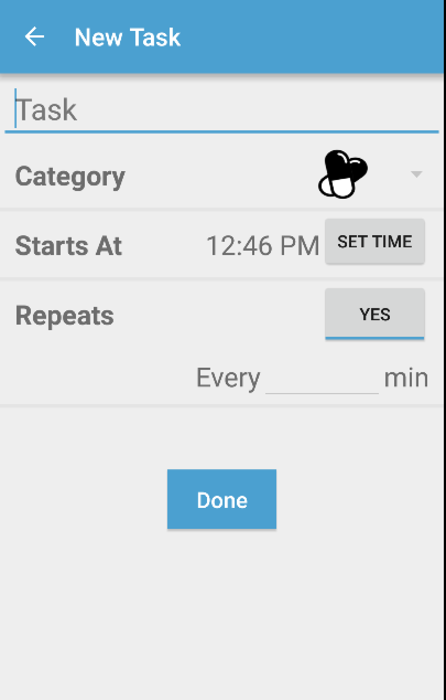

# Group-1-Project - MedAgenda

MedAgenda is a smartphone and smartwatch app that helps nurses take better care of their patients. MedAgenda is a to-do list app that allows nurses to view a patient’s tasks right on their smartwatch so that they do not have to go back and forth between the workstation. MedAgenda modernizes current hospital technology through integration with the hospital’s electronic record system to bring patient to do lists and reminders directly into a nurse's hands. 

## Authors

Jeff Tan, Weiming Wu, Aaron Zhang, Jaskirat Mahal, Derrick Hu

## Demo Video

See [MedAgenda] (https://www.youtube.com/watch?v=fnm6R57OuTQ)

## Screenshots

##MedAgenda server backend documentation 

server url: medagenda-backend.herokuapp.com
route: GET '/', '/patients', header should be 'application/json'
returns: [firstname: 'x', lastname: 'y', tasks: [{details: 'xyz'}], status: [{'details': 'hrhmx'}]}

